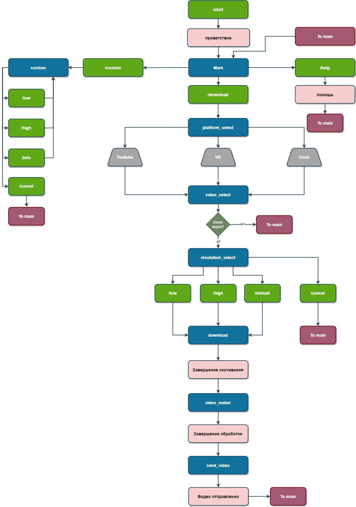

# VIDEO DOWNLOADER TELEGRAM BOT

Это телеграм-бот для скачивание видео с разных площадок таких как YouTube и Coub

## Установка
1. Клонируйте репозиторий
    ```commandline
    git clone git@gitlab.skillbox.ru:ivan_galinskii/python_basic_diploma.git
    ```
2. Создайте виртульное окружение
    ```commandline
    python3 -m venv new_env
    ```
3. Запускаем виртульное окружение
    - windows
    ```commandline
    new_env\Scripts\activate
    ```
    - linux
    ```commandline
    source new_env/bin/activate
    ```
4. Установите зависимости
    ```commandline
    pip install -r requirements.txt
    ```
5. Запустить бота
    ```commandline
    python main.py
    ```


## Принцип работы бота
